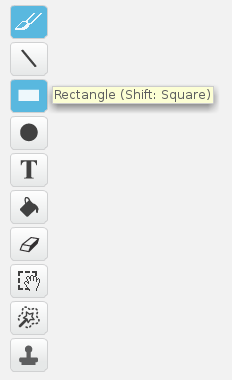

+ Click on the icon to the right of the **Sprites** pane to **Paint new backdrop**.

+ Use the drawing tool in the Backdrops tab to paint your backdrop.

+ When you are finished, don’t forget to give your new backdrop a sensible name.

<video width="1024" height="768" controls>
<source src="images/scratch_paint_new_backdrop.webm" type="video/webm">
Your browser does not support WebM video, so try FireFox or Chrome.
</video>
